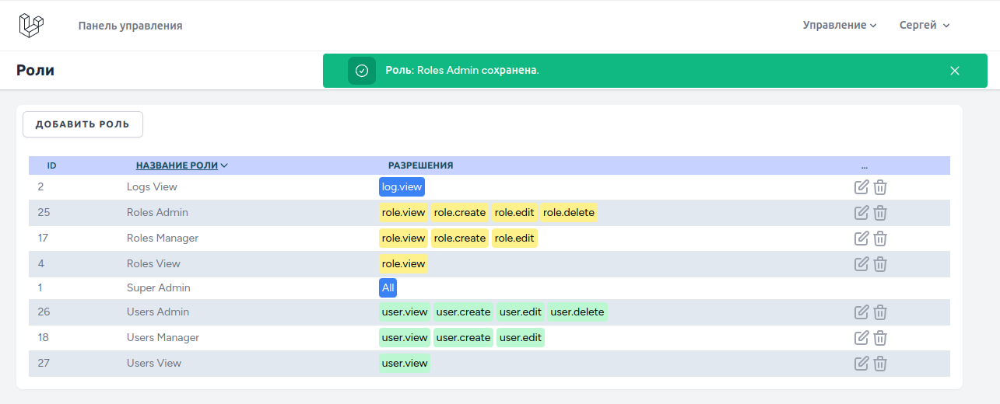
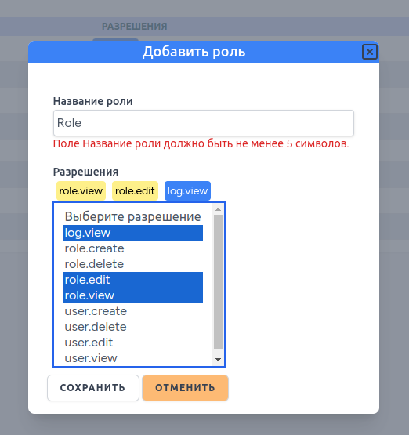

# Laravel 11 Breeze CRUD Roles, Users

## Развертывание:
```cmd
git clone https://github.com/eonvse/timedata2.1.git
cd laravel11
sudo chmod -R 775 storage
sudo chown -R $USER:www-data storage

alias sail='[ -f sail ] && sh sail || sh vendor/bin/sail'
sail up
sail shell

composer install
npm run build

cp .env.examlple .env
###Настройка БД###

php artisan key:generate

php artisan migrate

#php artisan db:seed#
php artisan db:seed --class=PermissionSeeder
##После регистрации на сайте первым пользователем можно запустить миграцию SuperAdmin##
php artisan db:seed --class=SuperAdminSeeder

```   	
* [Laravel 11](https://laravel.com/docs/11.x)
    * [Laravel Sail (Docker)](https://laravel.com/docs/11.x/sail#main-content)
    * [Laravel Breeze](https://laravel.com/docs/11.x/starter-kits#breeze-and-livewire)
    * [Spatie Permission](https://spatie.be/docs/laravel-permission/v6/installation-laravel)

## Роли




Маркеры разрешений:
>    'default' => 'bg-blue-500 text-white',
>    'role' => 'bg-yellow-200 text-black',
>    'task' => 'bg-sky-200 text-black',
>    'user' => 'bg-green-200 text-black',
>    'note' => 'bg-orange-100 text-black',

Маркеры ролей:
>    'default' => 'bg-blue-500 text-white',
>    'Roles' => 'bg-yellow-200 text-black',
>    'Tasks' => 'bg-sky-200 text-black',
>    'Users' => 'bg-green-200 text-black',
>    'Notes' => 'bg-orange-100 text-black',


### Сопровождение

* Re-authenticate with GitHub. 
```
gh auth login
```

### Авторские права:
* Фреймворки
	* [Laravel 11](https://laravel.com/docs/11.x)
	* [Tailwindcss 3](https://tailwindcss.com/docs/installation)
	* [Livewire 3](https://livewire.laravel.com/docs)
        * [Livewire Volt](https://livewire.laravel.com/docs/volt)
* SVG иконки
	* [Tailwind Toolbox](https://tailwindtoolbox.com/icons)
	* [SVG Repo - Search, explore, edit and share open-licensed SVG vectors](https://www.svgrepo.com/)
