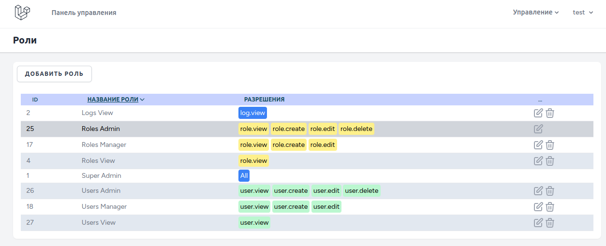

# Laravel 11 Breeze CRUD Roles, Users

# Каркас личного кабинета на основе Breeze с админскими CRUD (Роли, пользователи, просмотр логов) - (Spatie Permission)

## Развертывание:
```cmd
git clone https://github.com/eonvse/laravel11.git
```
```cmd
cd laravel11
```

```cmd
sudo chmod -R 775 storage
```

```cmd
sudo chown -R $USER:www-data storage
```

```cmd
alias sail='[ -f sail ] && sh sail || sh vendor/bin/sail'
sail up
sail shell
```
```cmd
composer install
npm run build
```
```cmd
cp .env.examlple .env
```
```cmd
php artisan key:generate
```

### Настройка БД


```cmd
php artisan migrate
```

```cmd
php artisan db:seed
```

```cmd
php artisan db:seed --class=PermissionSeeder
```

## После регистрации на сайте первым пользователем можно запустить миграцию SuperAdmin
```cmd
php artisan db:seed --class=SuperAdminSeeder
```   	
# Источники

* [Laravel 11](https://laravel.com/docs/11.x)
    * [Laravel Sail (Docker)](https://laravel.com/docs/11.x/sail#main-content)
    * [Laravel Breeze](https://laravel.com/docs/11.x/starter-kits#breeze-and-livewire)
    * [Spatie Permission](https://spatie.be/docs/laravel-permission/v6/installation-laravel)

## Роли



Маркеры разрешений:
> * 'default' => 'bg-blue-500 text-white'
> * 'role' => 'bg-yellow-200 text-black'
> * 'task' => 'bg-sky-200 text-black'
> * 'user' => 'bg-green-200 text-black'
> * 'note' => 'bg-orange-100 text-black'

Маркеры ролей:
> * 'default' => 'bg-blue-500 text-white'
> * 'Roles' => 'bg-yellow-200 text-black'
> * 'Tasks' => 'bg-sky-200 text-black'
> * 'Users' => 'bg-green-200 text-black'
> * 'Notes' => 'bg-orange-100 text-black'


## Сопровождение

* Re-authenticate with GitHub. 
```cmd
gh auth login
```

* git - Отключить измениние разрешений файлов
```cmd
git config core.filemode false 
```

### Авторские права:
* Фреймворки
	* [Laravel 11](https://laravel.com/docs/11.x)
	* [Tailwindcss 3](https://tailwindcss.com/docs/installation)
	* [Livewire 3](https://livewire.laravel.com/docs)
        * [Livewire Volt](https://livewire.laravel.com/docs/volt)
* SVG иконки
	* [Tailwind Toolbox](https://tailwindtoolbox.com/icons)
	* [SVG Repo - Search, explore, edit and share open-licensed SVG vectors](https://www.svgrepo.com/)
